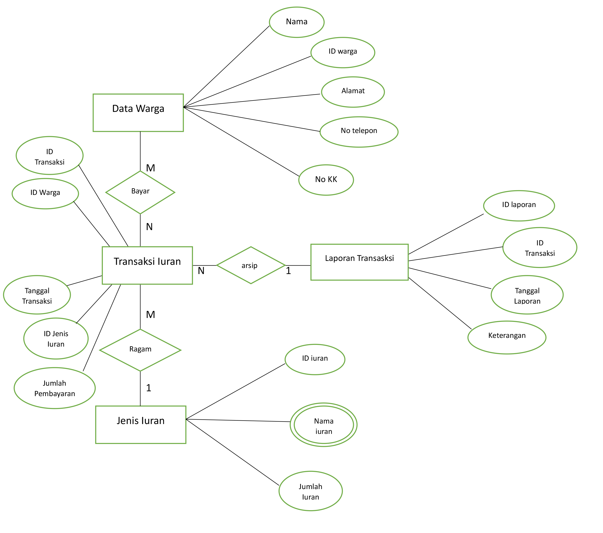

# ERD-kasrt

```
Nama : Raja hepyyanto
TI.22.a2
312210235

KELOMPOK 7

```

```

Assalamualikum wr. wb
```

### * diagram 



### * penjelasan erd 

```
Ada 4 entitas pada data pengelolaan kas RT 
1. Data warga
2. Jenis iuran
3. Transaksi pembayaran iuran
4. laporan transaksi.

* entitas data warga memiliki relationship "bayar" many to many pada entitas data transaksi iuran,
* entitas jenis iuran memiliki relationship "ragam/jenis" one to many pada entitas data transaksi iuran,
* entitas data transaksi iuran memiliki relationship"arsip" many to one pada entitas laporan keuangan

penjelasan atribut

masing masing entitas memiliki atribut kunci (key) maka dari itu tidak ada entitas yang termasuk weak entitas

terdapat i jenis atribut multyvalue di entitas jenis iuran

```

```
sekian dan terimakasih
```
